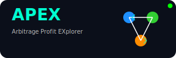

# 

A sophisticated Go-based system for detecting arbitrage opportunities across cryptocurrency exchanges in real-time.

[](https://github.com/VrushankPatel/apex/actions/workflows/go.yml)
[](https://golang.org/doc/go1.23)
[](https://github.com/VrushankPatel)
[](https://github.com/VrushankPatel)
[](LICENSE)
[](https://upx.github.io/)
[](https://apex-docs.readthedocs.io/en/latest/ARBITRAGE_GUIDE/#market-data-analysis)
[](https://apex-docs.readthedocs.io/en/latest/ARBITRAGE_GUIDE/#exchange-fragmentation)
[](https://apex-docs.readthedocs.io/en/latest/ARBITRAGE_GUIDE/)
[](https://apex-docs.readthedocs.io/)

## What is Arbitrage?

Arbitrage is the practice of taking advantage of price differences for the same asset in different markets. In the context of cryptocurrency trading, this means buying a cryptocurrency on one exchange where the price is lower and simultaneously selling it on another exchange where the price is higher, making a profit from the price difference.

## Features

- **Multi-Exchange Support**: Monitor prices on Binance, Kraken, and Coinbase (expandable to other exchanges)
- **Real-Time Detection**: Identify arbitrage opportunities as they appear
- **Configurable Thresholds**: Set minimum profit thresholds to filter opportunities
- **Web Interface**: Interactive UI for monitoring market data and opportunities
- **WebSocket Updates**: Real-time data pushed to the browser
- **Historical Analysis**: Track past opportunities and overall performance
- **Simulation Mode**: Test the system without real trades using simulated data

## How It Works

1. **Data Collection**: The system connects to multiple cryptocurrency exchanges via their WebSocket APIs to receive real-time market data
2. **Arbitrage Detection**: Continuously compares prices across exchanges to identify opportunities where buying on one exchange and selling on another would result in profit
3. **Profit Calculation**: Accounts for exchange fees, network/gas fees, and slippage to calculate real potential profit
4. **Notification**: Alerts the user to opportunities meeting the configured profit threshold
5. **Analysis**: Tracks statistics on opportunities over time

## Arbitrage Calculation

The system uses the following formula to calculate arbitrage opportunities:

```
Profit Percentage = ((Sell Price - Buy Price) / Buy Price) * 100 - Fees
```

Where:
- **Buy Price**: The "ask" price on the exchange with the lower price
- **Sell Price**: The "bid" price on the exchange with the higher price
- **Fees**: Combined fees from both exchanges and transfer costs

An opportunity is considered viable when the profit percentage exceeds the configured minimum threshold.

## Setup and Installation

### Prerequisites

- Go 1.18 or higher
- API keys for supported exchanges

### Installation

1. Clone the repository
   ```bash
   git clone https://github.com/yourusername/apex-arbitrage.git
   cd apex-arbitrage
   ```

2. Install dependencies
   ```bash
   go mod tidy
   ```

3. Set up your configuration
   ```bash
   cp .env.example .env
   # Edit .env with your API keys and preferences
   ```

4. Build the project
   ```bash
   go build -o apex
   ```

5. Run the application
   ```bash
   ./apex
   ```

6. Open a browser and navigate to `http://localhost:8080`

## Configuration

You can configure the application by editing the `.env` file:

- `SIMULATION_MODE`: Set to `false` to connect to real exchanges using your API keys
- `MIN_PROFIT_THRESHOLD`: Minimum profit percentage to consider an opportunity valid
- `LOG_LEVEL`: Detail level for logging (`debug`, `info`, `warn`, `error`)
- Exchange API keys and secrets (see `.env.example` for required fields)

## Exchange API Keys

To use the system with real data, you'll need to create API keys on each exchange:

- **Binance**: [Create API Keys](https://www.binance.com/en/support/faq/how-to-create-api-keys-on-binance-360002502072)
- **Kraken**: [Create API Keys](https://support.kraken.com/hc/en-us/articles/360000919966-How-to-generate-an-API-key-pair-)
- **Coinbase**: [Create API Keys](https://help.coinbase.com/en/pro/other-topics/api/how-do-i-create-an-api-key-for-coinbase-pro)

⚠️ **Important Security Notes**:
- Use read-only API keys when possible (price monitoring doesn't require trading permissions)
- Never share your API keys or secrets
- Store `.env` file securely and don't commit it to version control

## Contributing

Contributions are welcome! Please feel free to submit a Pull Request.

## License

This project is licensed under the MIT License - see the LICENSE file for details.

## Disclaimer

This software is for educational purposes only. Cryptocurrency trading involves significant risk. No part of this software constitutes financial advice. Always do your own research before engaging in cryptocurrency trading.

---

## Detailed Technical Architecture

### Component Structure

The application is organized into several packages:

- **cmd/main.go**: Entry point and application initialization
- **pkg/config**: Configuration management
- **pkg/exchange**: Exchange client implementations
- **pkg/detector**: Arbitrage detection logic
- **pkg/models**: Data models
- **pkg/server**: Web server and WebSocket handling
- **web/**: Frontend files (HTML, CSS, JavaScript)

### Arbitrage Detection Algorithm

The core algorithm works as follows:

1. Maintain order books (bid/ask prices) for each trading pair on each exchange
2. For each pair of exchanges (A and B):
   - Check if buying on exchange A and selling on exchange B is profitable
   - Check if buying on exchange B and selling on exchange A is profitable
3. Calculate profit after accounting for:
   - Exchange trading fees
   - Transaction/withdrawal fees
   - Slippage (price movement during execution)
4. If profit exceeds the minimum threshold, record the opportunity

### Performance Considerations

- **Latency**: The system is designed to minimize latency between detection and notification
- **Exchange Rate Limits**: Respects API rate limits to avoid being blocked
- **Error Handling**: Robust error handling for network issues and exchange downtime
- **Reconnection Logic**: Automatically reconnects when a connection is lost