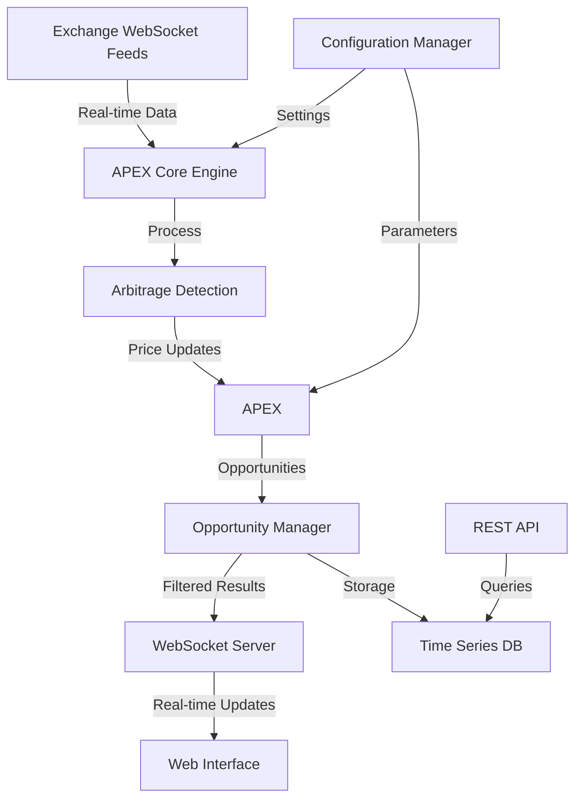

# Technical Architecture Guide

## System Overview

APEX is designed as a high-performance, real-time arbitrage detection system for cryptocurrency markets. This document details the technical architecture and design decisions that power the system.

## Architecture Diagram



## Core Components

### 1. Data Ingestion Layer (`pkg/exchange`)
- Manages WebSocket connections to exchanges
- Normalizes market data formats
- Implements automatic reconnection logic
- Handles rate limiting and backoff strategies

### 2. Order Book Manager (`pkg/models`)
```go
type OrderBook struct {
    Bids map[float64]float64
    Asks map[float64]float64
    Mutex sync.RWMutex
}
```
- Maintains real-time order books
- Thread-safe price updates
- Efficient memory management
- Quick access to best bid/ask prices

### 3. APEX Core (`pkg/detector`)
- Implements core arbitrage detection algorithm
- Calculates profit opportunities considering:
  - Exchange fees
  - Network fees
  - Slippage estimates
- Configurable profit thresholds
- Concurrent opportunity detection

### 4. Web Server (`pkg/server`)
- Handles HTTP/WebSocket connections
- Serves web interface
- Provides REST API endpoints
- Manages client sessions

## Data Flow

1. **Market Data Ingestion**
   ```go
   func (e *Exchange) processMarketData(data []byte) {
       // Parse incoming data
       // Update order books
       // Trigger arbitrage detection
   }
   ```

2. **Arbitrage Detection**
   ```go
   func (d *Detector) DetectArbitrage(books map[string]*OrderBook) []Opportunity {
       // Compare prices across exchanges
       // Calculate potential profits
       // Filter viable opportunities
   }
   ```

3. **Client Updates**
   ```go
   func (s *Server) broadcastOpportunity(opp *Opportunity) {
       // Format opportunity data
       // Send to connected clients
       // Store in database
   }
   ```

## Performance Optimizations

### Memory Management
- Ring buffers for historical data
- Efficient order book updates
- Garbage collection tuning
- Memory pooling for common objects

### CPU Optimization
- Lock-free algorithms where possible
- Batch processing of updates
- Concurrent processing pipelines
- CPU profile-guided optimizations

### Network Optimization
- WebSocket connection pooling
- Binary protocol for data transfer
- Compression for large payloads
- Keep-alive connection management

## Configuration Management

### Environment Variables
```bash
APEX_LOG_LEVEL=info
APEX_MIN_PROFIT=0.5
APEX_MAX_CONNECTIONS=100
APEX_WEBSOCKET_TIMEOUT=30s
```

### Runtime Configuration
```go
type Config struct {
    Exchanges       []ExchangeConfig
    ProfitThreshold float64
    UpdateInterval  time.Duration
    MaxConnections  int
}
```

## Monitoring and Metrics

### Key Metrics
- Order book update latency
- Arbitrage detection time
- Opportunity count/quality
- Exchange connection status
- System resource usage

### Health Checks
- Exchange connectivity
- Database connection
- Memory usage
- CPU utilization
- Network latency

## Error Handling

### Recovery Strategies
1. Automatic reconnection
2. Circuit breakers
3. Rate limit handling
4. Error propagation
5. Graceful degradation

### Logging
```go
func (s *System) logError(err error, context map[string]interface{}) {
    // Log error with context
    // Update metrics
    // Trigger alerts if needed
}
```

## Security Considerations

### Data Protection
- TLS for all connections
- API key encryption
- Secure configuration storage
- Access control mechanisms

### Rate Limiting
- Per-IP limits
- Per-endpoint limits
- Automatic blocking
- Whitelist/blacklist support

## Testing Architecture

### Unit Tests
- Component-level testing
- Mock exchange interfaces
- Simulated market data
- Performance benchmarks

### Integration Tests
- End-to-end workflows
- Multi-exchange scenarios
- Network failure handling
- Load testing

## Deployment Architecture

### Container Structure
```dockerfile
FROM golang:1.18-alpine
WORKDIR /app
COPY . .
RUN go build -o apex
EXPOSE 8080
CMD ["./apex"]
```

### Scaling Strategy
- Horizontal scaling
- Load balancing
- Database sharding
- Cache distribution

## Future Considerations

### Planned Improvements
1. Machine learning for opportunity prediction
2. Advanced risk management
3. Multi-currency arbitrage paths
4. Cross-chain integration
5. Automated trading execution

### Scalability Roadmap
1. Microservices architecture
2. Event-driven processing
3. Distributed detection
4. Global deployment

## References

- [Go Documentation](https://golang.org/doc/)
- [WebSocket Protocol](https://tools.ietf.org/html/rfc6455)
- [Exchange APIs](docs/API.md)
- [Contributing Guide](docs/CONTRIBUTING.md) 