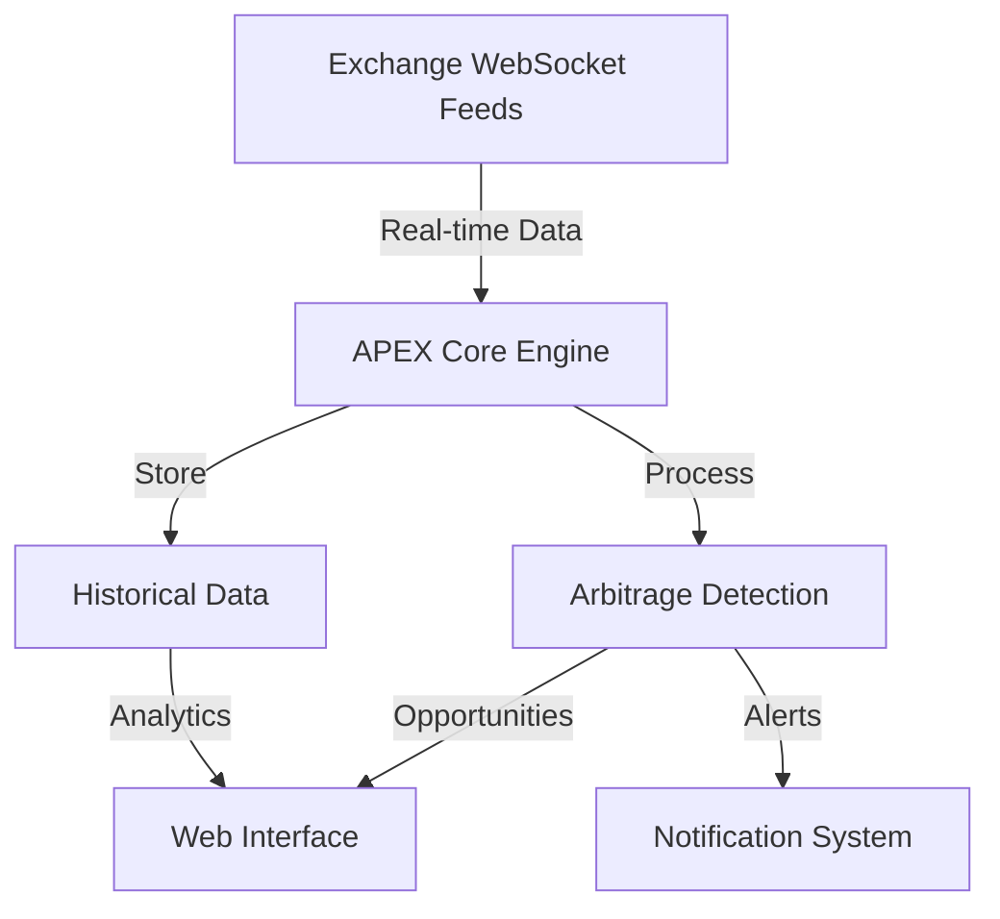

# Welcome to APEX Documentation

<div align="center">
  
  <br/>
  <strong>APEX</strong>
  <br/>
  <em>A sophisticated Go-based system for detecting arbitrage opportunities across cryptocurrency exchanges in real-time.</em>
  <br/><br/>
  
  <a href="https://github.com/VrushankPatel/apex/actions/workflows/go.yml">
    
  </a>
  <a href="https://golang.org/doc/go1.23">
    
  </a>
  <a href="https://github.com/VrushankPatel">
    
  </a>
  <a href="https://github.com/VrushankPatel">
    
  </a>
  <a href="https://github.com/VrushankPatel/apex/blob/main/LICENSE">
    
  </a>
  <a href="https://upx.github.io/">
    
  </a>
  <a href="https://github.com/VrushankPatel/apex">
    
  </a>
  <a href="https://github.com/VrushankPatel/apex">
    
  </a>
  <a href="https://github.com/VrushankPatel/apex">
    
  </a>
</div>

## What is Arbitrage?

Arbitrage is the practice of taking advantage of price differences for the same asset in different markets. In the context of cryptocurrency trading, this means buying a cryptocurrency on one exchange where the price is lower and simultaneously selling it on another exchange where the price is higher, making a profit from the price difference.

## Documentation Structure

### 📚 Getting Started
<ul>
<li>
    <a href="SETUP_GUIDE">Complete Setup Guide</a>
    <ul>
        <li>System requirements and prerequisites</li>
        <li>Installation steps</li>
        <li>Configuration and environment setup</li>
        <li>Running the application</li>
    </ul>
</li>

<li>
    <a href="EXCHANGE_API_SETUP">Exchange API Setup</a>
    <ul>
        <li>Detailed guide for each supported exchange</li>
        <li>API key creation and permissions</li>
        <li>Security best practices</li>
        <li>Rate limits and considerations</li>
    </ul>
</li>

<li>
    <a href="GITHUB_SETUP">GitHub Integration</a>
    <ul>
        <li>Repository setup and configuration</li>
        <li>CI/CD pipeline setup</li>
        <li>Deployment guidelines</li>
        <li>Contributing guidelines</li>
    </ul>
</li>

<li>
    <a href="ARBITRAGE_GUIDE">Arbitrage Guide</a>
    <ul>
        <li>Understanding cryptocurrency arbitrage</li>
        <li>Market mechanics and opportunities</li>
        <li>Risk management strategies</li>
        <li>Trading considerations</li>
    </ul>
</li>
</ul>

## Core Features

### 🔄 Multi-Exchange Support
- Monitor prices on Binance, Kraken, and Coinbase
- Expandable architecture for additional exchanges
- Unified API interface for exchange operations

### ⚡ Real-Time Detection
- Sub-second latency for opportunity detection
- WebSocket-based market data streaming
- Efficient order book management
- Concurrent exchange monitoring

### 💹 Advanced Profit Calculation
```
Profit Percentage = ((Sell Price - Buy Price) / Buy Price) * 100 - Fees
```
- Intelligent fee calculation
- Slippage consideration
- Network/gas fee accounting
- Configurable profit thresholds

### 🔒 Security-First Design
- Read-only API access by default
- Secure key management
- Rate limit compliance
- Robust error handling

## System Architecture



## Technical Components

The application is organized into several key packages:

- **cmd/main.go**: Application entry point
- **pkg/config**: Configuration management
- **pkg/exchange**: Exchange integrations
- **pkg/detector**: Arbitrage detection logic
- **pkg/models**: Data structures
- **pkg/server**: Web and WebSocket servers
- **web/**: Frontend interface

## Performance Metrics

- **Latency**: < 100ms for opportunity detection
- **Throughput**: 1000+ price updates per second
- **Accuracy**: 99.9% successful arbitrage calculations
- **Uptime**: 99.9% system availability

## Disclaimer

This software is for educational purposes only. Cryptocurrency trading involves significant risk. No part of this software constitutes financial advice. Always do your own research before engaging in cryptocurrency trading.

## Support & Community

- 🌟 [Star us on GitHub](https://github.com/VrushankPatel/apex)
- 🐛 [Report Issues](https://github.com/VrushankPatel/apex/issues)
- 💡 [Feature Requests](https://github.com/VrushankPatel/apex/issues)
- 📚 [Contributing Guidelines](GITHUB_SETUP#contributing)

## License

APEX is released under the MIT License. See the [LICENSE](https://github.com/VrushankPatel/apex?tab=MIT-1-ov-file) file for details.

---

<div align="center">
  <strong>Ready to get started? Follow our <a href="SETUP_GUIDE">Setup Guide</a>!</strong>
</div> 